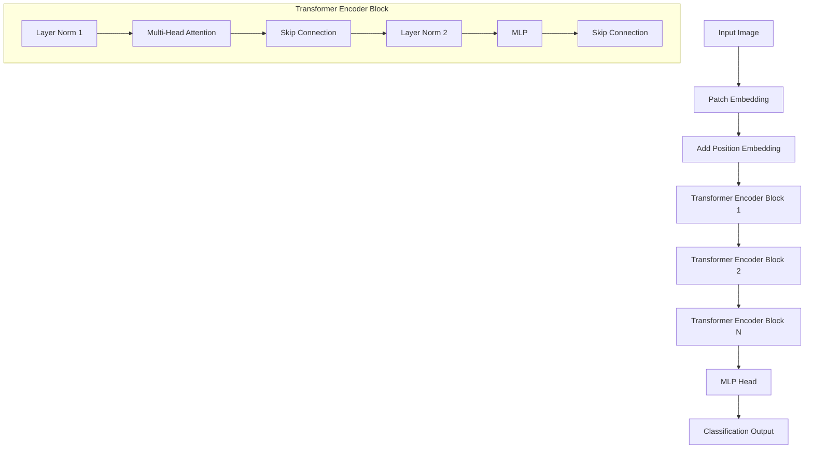
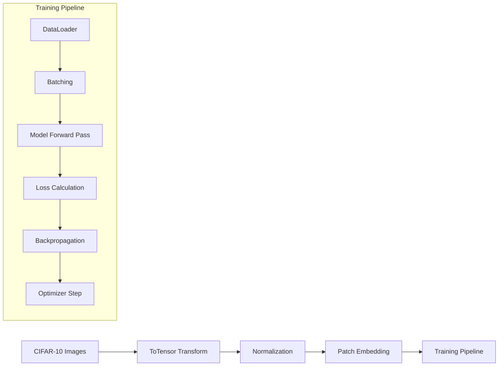
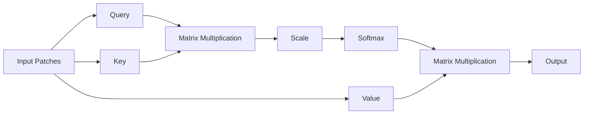
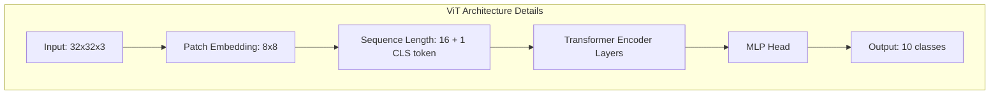

# Vision Transformer (ViT) Implementation for CIFAR-10

This repository contains an implementation of the Vision Transformer (ViT) model for image classification using PyTorch. The model is trained and evaluated on the CIFAR-10 dataset.

## Architecture Overview



## Data Processing Pipeline



## Attention Mechanism



## Requirements

```bash
torch
torchvision
torchmetrics
matplotlib
numpy
```

## Project Structure

```
.
├── vit_main.ipynb          # Main notebook with training pipeline
├── transformer_models.py    # ViT model implementation
└── data/                   # Directory for CIFAR-10 dataset
```

## Patch Embedding Process


## Implementation Details

### Data Loading and Preprocessing

The implementation uses the CIFAR-10 dataset with the following preprocessing steps:
- Images are normalized with mean (0.5, 0.5, 0.5) and std (0.5, 0.5, 0.5)
- Supports customizable batch size and subset selection
- Data augmentation through torchvision transforms

```python
def get_data_loaders(batch_size=128, train_subset_size=600, test_subset_size=200):
    transform = transforms.Compose([
        transforms.ToTensor(),
        transforms.Normalize((0.5, 0.5, 0.5), (0.5, 0.5, 0.5))
    ])
    trainset = torchvision.datasets.CIFAR10(root='./data', train=True,
                                          download=True, transform=transform)
    train_subset = Subset(trainset, torch.arange(train_subset_size))
    trainloader = DataLoader(train_subset, batch_size=batch_size,
                           shuffle=True, num_workers=2)
    
    testset = torchvision.datasets.CIFAR10(root='./data', train=False,
                                         download=True, transform=transform)
    test_subset = Subset(testset, torch.arange(test_subset_size))
    testloader = DataLoader(test_subset, batch_size=batch_size,
                          shuffle=False, num_workers=2)
    
    return trainloader, testloader
```

### Model Architecture Details



### Training Configuration

- **Optimizer**: Adam
- **Loss Function**: Cross Entropy Loss
- **Learning Rate**: 0.001
- **Epochs**: 2 (configurable)
- **Device**: CPU/GPU based on availability
- **Batch Size**: 128 (default)

### Metrics Tracked

The implementation tracks the following metrics during training and validation:
1. Loss (Training and Validation)
2. Accuracy (Standard, Top-1, Top-5)
3. Area Under ROC Curve (AUC)
4. F1 Score
5. Precision
6. Recall

### Performance Monitoring Flow


### Training and Evaluation Functions

The implementation includes comprehensive training and evaluation functions:

```python
def train(model, dataloader, criterion, optimizer):
    # Training function implementation
    # Returns: loss, accuracy, AUC, F1, precision, recall, top1_acc, top5_acc

def evaluate(model, dataloader, criterion):
    # Evaluation function implementation
    # Returns: loss, accuracy, AUC, F1, precision, recall, top1_acc, top5_acc
```

### Visualization Features

The implementation includes attention visualization capabilities through the `attn_viz` function:
- Original image display
- Attention heatmap generation
- Overlay visualization of attention weights

```python
def attn_viz(image, attention_grid):
    # Creates visualization with:
    # 1. Original image
    # 2. Attention heatmap
    # 3. Overlay of attention on original image
```

## Usage

1. Import required libraries and setup environment:
```python
%run transformer_models.py
import torch
import torchvision
import torchvision.transforms as transforms
from torch.utils.data import DataLoader, Subset
```

2. Initialize data loaders:
```python
train_loader, test_loader = get_data_loaders()
```

3. Create and train the model:
```python
model = VisionTransformer().to(device)
criterion = nn.CrossEntropyLoss()
optimizer = optim.Adam(model.parameters(), lr=learning_rate)

# Training loop
for epoch in range(num_epochs):
    train_metrics = train(model, train_loader, criterion, optimizer)
    val_metrics = evaluate(model, test_loader, criterion)
```

## Performance Monitoring

The implementation provides:
- Real-time metric tracking during training
- Comprehensive performance visualization
- Attention map visualization for model interpretation
- Detailed logging of all relevant metrics

## Notes

- The implementation supports customizable hyperparameters
- Attention visualization helps in understanding model focus areas
- Comprehensive metric tracking enables detailed performance analysis
- The model architecture follows the original ViT paper with modifications for CIFAR-10

## Authors

Vignesh Ram Ramesh Kutti
Aravind Balaji Srinivasan

## Citation

```bibtex
@misc{dosovitskiy2021image,
      title={An Image is Worth 16x16 Words: Transformers for Image Recognition at Scale}, 
      author={Alexey Dosovitskiy and Lucas Beyer and Alexander Kolesnikov and Dirk Weissenborn and Xiaohua Zhai and Thomas Unterthiner and Mostafa Dehghani and Matthias Minderer and Georg Heigold and Sylvain Gelly and Jakob Uszkoreit and Neil Houlsby},
      year={2021},
      eprint={2010.11929},
      archivePrefix={arXiv},
      primaryClass={cs.CV}
} 
```
